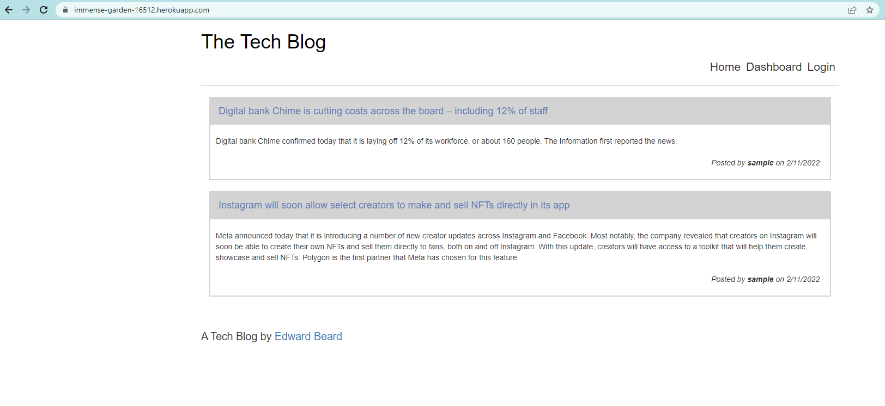

# tech-blog
## Badges
  
  
  ## Table of Contents
  * [License](#license)
  * [Built With](#built-with) 
  * [Description](#description)
  * [Installation](#installation)
  * [Usage](#usage)
  * [How to Contribute](#how-to-contribute)
  * [Tests](#tests)
  * [Questions?](#questions)
  
  ## License
  Read more about MIT here:
  [MIT](https://opensource.org/licenses/MIT)

  ## Built With
  * Node.js
  * MYSQL
  * Express.js
  * Sequelize
  * Express-Handlebars
  * Sequelize
  
  
  ## Description
  This Tech Blog is a CMS Sytle project that utilizes the MVC Structure, routes, SQL, and Handlebars for templates. This website will allow users to view & edit posts. Users will laso have the ablilty to leave comments, login & register. 

  
  
  ## Installation
  To installl the files to your local repository, use the Git Bash Terminal: 
  
  1. Create Project folder to clone the repo into
  2. Clone with SSH using "git@github.com:erbeard/tech-blog.git"
  
  Install the folling packages:

    npm i init -y

    npm i bcrypt connect-session-sequelize dotenv express express-handlebars express-session  handlebars inquirer mysql2 nodemon sequelize
  
  ## Usage
  Start the server by running "npm start". Leverage Insomnia to navigate the API routes. 

  Live Link: https://immense-garden-16512.herokuapp.com/
  
  ## How to Contribute
  [Contributor Covenant](https://www.contributor-covenant.org/)  
  Not Applicable
  
  ## Tests
  Not Applicable
  
  ## Questions?
  ### Reach me here: 
  [erbeard](https://github.com/erbeard)  
  sample@sample.com